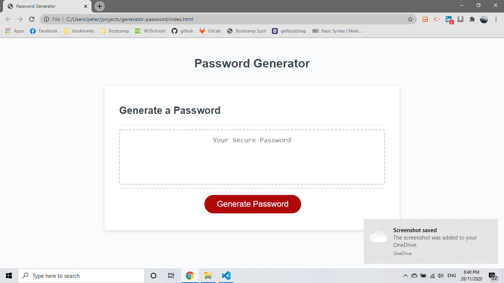

# generator-password

In this project the user can create a unique password , in the begine there are question about the lenght of the passwords and which kind elements wents to include in the password.

There are some parameters before the password will create , the password has between 8 to 128 characters and at least one of the categories Lower case , Upper Case , Numbers and Special . If the user pick out of the range 8 to 128 the website will repeat the question at in the end for the lenght of the password and also if the user didn;t chhose any categories the user will see in the screen again the question with a message before need at least ont category to pick for the password.

The following image , the user will see the first question of the setup the password and it is the lenght of the password.

