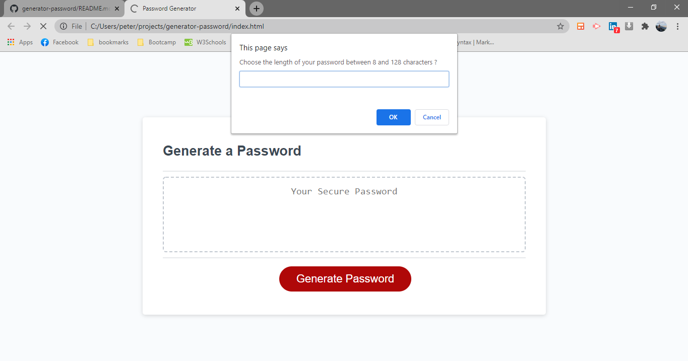
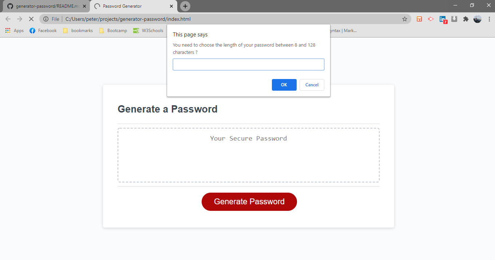
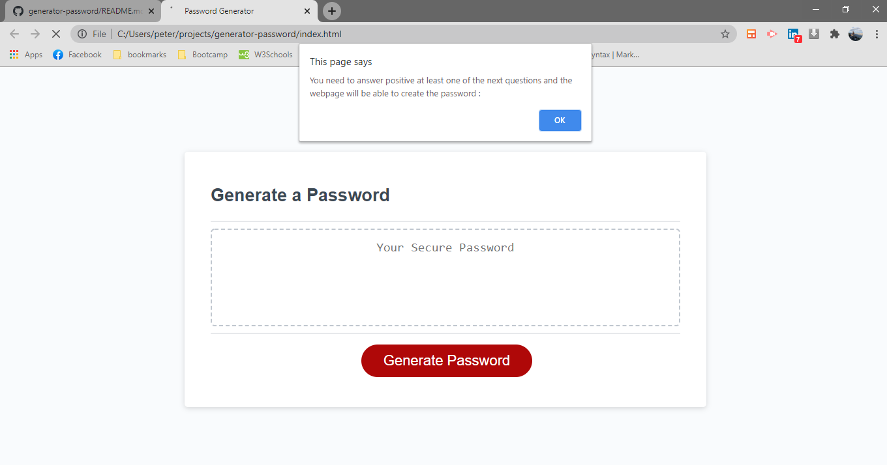
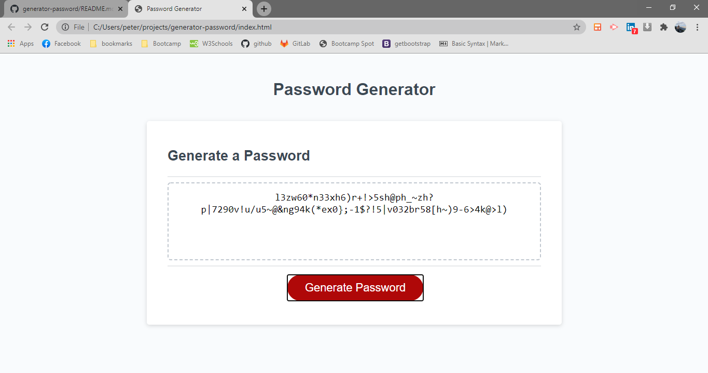

# generator-password

## link

repository :   https://github.com/pfotis/generator-password
webpage    :   https://pfotis.github.io/generator-password/

In this project the user can create a unique password , in the begine there are question about the lenght of the passwords and which kind elements wents to include in the password.

There are some parameters before the password will create , the password has between 8 to 128 characters and at least one of the categories Lower case , Upper Case , Numbers and Special . If the user choose out of the range 8 to 128 the website will repeat the question at in the end for the lenght of the password and also if the user didn;t chhose any categories the user will see in the screen again the questions with a message before need to choose at least one category to pick for the password.

The password will have at least one characters from all the categories the user choose.

### The following image , the user will see the first question of the setup the password and it is the lenght of the password with range between 8 to 128 characters.

### If the user will type bigger number from 128 or smaller from 8 at the end of the question the webpage will repeat the question for the length of the password, until will give an answer between the 8 and 128.

### The following images they are the questions to help the user what kind password likes.

### If the user didn't choose any of the categories the webpage will ask again until the user choose at least one of all the caegories.

### At the final image the user will see the password. If the user click again the button generate password , the user will see different password with the same specifications user gave in the firsts questions.

